  

  
  
  
  
  

# 🚀 Top Open-Source AI Agents 🤖

A curated list 📚 of the most popular open-source AI agents on GitHub 🌟, ranked by the number of stargazers ⭐. This list is a valuable resource for researchers 🔬, developers 👨‍💻, and anyone interested in the exciting field of autonomous AI agents 🤖 and LLM applications 🧠.

| 🤖 Agent Name | 📝 Description | ⭐ Stars |
| --- | --- | --- |
| [AutoGPT](https://github.com/Significant-Gravitas/AutoGPT) 🧠 | An autonomous open-source AI agent that attempts to achieve user-defined goals through multi-step task execution and internet access. 🌐 | 187K |
| [Dify](https://github.com/langgenius/dify) 🎨 | An open-source LLM application development platform combining visual interfaces, RAG pipelines, agent capabilities, and orchestration. 🛠️ | 154K |
| [Langflow](https://github.com/langflow-ai/langflow) ⚡ | A dynamic, visual drag-and-drop framework for building, testing, and deploying multi-agent workflows and LLM applications. 🔄 | 154K |
| [LangChain](https://github.com/langchain-ai/langchain) 🔗 | A foundational framework for chaining LLM calls, memory, and tools into composable, multi-tool AI agents. 🧩 | 146K |
| [browser-use](https://github.com/browser-use/browser-use) 🌐 | An open-source framework enabling autonomous AI agents to interact with web browsers, click, scroll, and complete web tasks. 🖱️ | 112K |
| [OpenHands](https://github.com/All-Hands-AI/OpenHands) 👨‍💻 | Formerly OpenDevin, an open-source autonomous AI software developer capable of writing code, running tests, and fixing bugs. 💻 | 85K |
| [MetaGPT](https://github.com/geekan/MetaGPT) 🛠️ | A multi-agent framework incorporating human SOPs to assign roles (product manager, architect, engineer) to agents for end-to-end software development. 🏗️ | 69K |
| [Open Interpreter](https://github.com/openinterpreter/open-interpreter) 💻 | A natural language interface that executes Python, JavaScript, Bash, and more locally on your machine with terminal access. 💻 | 68K |
| [AutoGen](https://github.com/microsoft/autogen) 🤖 | A framework by Microsoft for developing multi-agent LLM applications where agents converse and collaborate to solve complex tasks. 🤝 | 61K |
| [CrewAI](https://github.com/crewAIInc/crewAI) 👨‍👩‍👧‍👦 | A framework for orchestrating collaborative, role-playing autonomous AI agents for structured and intelligent team workflows. 👥 | 58K |
| [gpt-engineer](https://github.com/AntonOsika/gpt-engineer) 👷 | An AI agent that builds entire codebases and software projects from a natural language prompt, asking clarifying questions as needed. 🔨 | 55K |
| [LlamaIndex](https://github.com/run-llama/llama_index) 🦙 | A data framework for LLM applications providing data ingestion, vector indexing, and agentic query engines over private data. 📊 | 52K |
| [Huginn](https://github.com/huginn/huginn) 🐦 | An open-source system for building automated agents that monitor online events, scrape web data, and trigger real-time actions. ⚡ | 50K |
| [LangGraph](https://github.com/langchain-ai/langgraph) 🕸️ | A low-level orchestration library for building controllable, stateful, multi-agent systems with cyclic execution and human-in-the-loop support. 🔄 | 41K |
| [AgentGPT](https://github.com/reworkd/AgentGPT) 🌐 | A browser-based platform allowing users to configure and deploy autonomous AI agents with recursive goal execution. 🚀 | 36K |
| [Composio](https://github.com/ComposioHQ/composio) 🔌 | An integration platform and tool-calling infrastructure providing 250+ tools, authentication, and actions for AI agents. 🛠️ | 30K |
| [GPT Researcher](https://github.com/assafelovic/gpt-researcher) 🕵️‍♂️ | An autonomous agent framework specialized for comprehensive online research, gathering sources, filtering bias, and producing detailed reports. 📑 | 29K |
| [BabyAGI](https://github.com/yoheinakajima/babyagi) 👶 | One of the pioneering recursive task agents, creating, prioritizing, and completing tasks iteratively based on an objective. 🎯 | 22K |
| [SuperAGI](https://github.com/TransformerOptimus/SuperAGI) 🚀 | An open-source autonomous AI framework to build, manage, and run autonomous agents with concurrent execution and graphical dashboard. 📊 | 18K |
| [AgentVerse](https://github.com/OpenBMB/AgentVerse) 🌌 | A multi-agent simulation framework for exploring cooperation, competition, and emergent social behavior among LLM agents. 🌐 | 5K |

### 💬 Community & Support 🤝

- **💬 [Discord](https://discord.com/invite/jc4xtF58Ve):** Chat with us on Discord for real-time support and discussions. 💬
- **🐦 [Twitter](https://twitter.com/ishandutta2007):** Follow us on Twitter for the latest news and updates. 📢
- **🐙 [Github](https://github.com/ishandutta2007):** Follow me on Github for the latest commits and updates. 🚀

## 💖 Support & Sponsorship 🎁

If you find this project helpful or if it has saved you time and resources, please consider sponsoring the development. Your support helps maintain the project, develop new features, and keep the initiative open-source. 🌟

👉 **[Sponsor @ishandutta2007 on GitHub](https://github.com/sponsors/ishandutta2007)** 💖

Every contribution, no matter how small, makes a huge difference! 🙏

##  Star History

